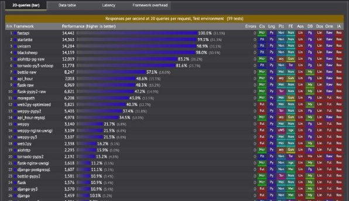

# Sujet PEX 

Ce logiciel structuré selon deux niveaux applicatifs en interaction :  

- Application frontale (ou frontend) assurant l’interface homme-machine 
- Application dorsale (ou backend) destiné à un traitement. 

## Application frontale 

L’interface visible par l’utilisateur est une application web développée en HTML/CSS/JS. Elle utilise la librairie jQuery pour faire des appels ajax vers l’application backend. 

Afin d’accélérer l’affichage, nous n’avons pas utilisé de librairie graphique (type bootstrap) mais sommes restés sur du CSS pur. 

Dans l’écran principal sont disposés le résultat retourné par l’API ainsi que son temps de réponse. 

## Application dorsale 

Afin de répondre aux attentes en termes de performances, nous nous sommes appuyés sur les résultats du benchmark des performances de montée en charge effectuée par TechEmpower 

Celui-ci place “Fast API” en haut du classement, c’est pourquoi nous avons décidé de l’utiliser sur ce projet. 

La création d'un point de terminaison d'API avec Fast API prend très peu de temps et la génération d’une documentation OpenAPI (Swagger) se fait de manière automatique. 

Nous avons utilisé Uvicorn qui est une implémentation de serveur ASGI (**A**sync **S**erver **G**ateway **I**nterface) ultra-rapide. 

## Déploiement 

L’application front et back ont étés déployées sur un serveur Linux tournant sur un Raspberry Pi. L’application front est servie par un serveur web type Apache2. 

L’application back est daemonzié et écoute sur le port 8000. 

## Projet 

Afin de réaliser ce projet nous avons travaillé en binôme en se partageant les tâches liées à son développement. 

La phase d’étude a été réalisée en binôme, n’étant pas habitués des langages python/C/C++, celle-ci a représenté la majeure partie du temps consommé pour le projet. Nous nous sommes ensuite partagé les tâches liées à son développement ainsi : 

Application frontale & Déploiement : Benjamin CORNOU

Application dorsale : Guillaume CRUSCA 

Nous avons travaillé en pair-programming sur les tâches de développement. L’ensemble des codes produits est disponible sur le[ repository GitHub.](https://github.com/Bencor29/fibo_python/) 
